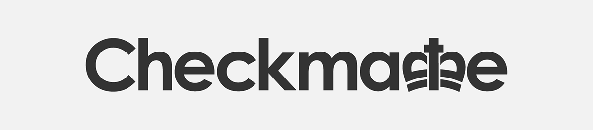

# Code of Conduct

 
## Introduction
CheckMate is a group that is made up of diverse, brilliant people and enthusiastic 
programmers. Collaboration between group members and productive communication with the 
tutor are critical factors for the teamwork. While Roehampton’s Students Code of Conduct 
is providing the official framework for our group( *[Roehampton's Student Code of Coduct](https://www.roehampton.ac.uk/globalassets/documents/corporate-information/policies/student-code-of-conduct-july-2018.pdf)*) , 
our group’s Code of Conduct defines 
the minimum requirements of professional behaviour we expect from each member of the group.
Our goal is to help each member of the group to reach their potential,where everyone feels safe,
accepted and valued.

## Our pledge
We vow to act socially responsible and in an honourable manner. 
All our procedures and activities must abide by all relevant international, national 
and local laws and contractual terms.

## Standards
All members of the group need to realize that behaving socially responsible and in
an honourable manner is essential for our group’s identity and they are expected to conduct 
themselves as respectful citizens of both the group/university and the local community.
	
	
Examples of conduct that promotes a constructive environment:

* Demonstrating empathy and kindness toward group members
* Being punctual for classes and other appointments.
* Being respectful of differing opinions ,viewpoints and experiences
* Giving and accepting constructive feedback 
* Accepting responsibilities and apologizing to those affected by your mistakes/decisions
* Focusing on what is best not for ourselves, but for the whole group
* Always be clear in your instructions/advices/feedback
	
The group considers the form of inappropriate conduct that are set out below to constitute 
misconduct that is likely to lead to disciplinary action. The list shouldn't be considered exhaustive.

Examples of conduct that may lead to disciplinary action:
	
* Public or private harassment
* Plagiarism / Duplication/Falsification/Cheating
* Collusion
* Missing work deadlines
* Failing to comply with any group's rule, regulation or policy
* Breaking the law
* Fraud,deceit,deception or dishonesty in relation to group members
* Misuse or unauthorised use of group's resources,including taking/manipulating/sharing of code without group's approval

## Enforcement responsibilities
	
The group has the authority to establish procedures and impose disciplinary action on a student 
that fail to abide or repeatedly/intentionally fail to abide by the standards of Code of Conduct.
The Code of Conduct encourages group's members to raise allegations with Group Leader of members 
misconduct,esspecialy where it may be possible to address these promtly.  
If any member want to appeal a decision issued by the Discipline Comittee, they need to do it in 
writing within 10 working days after the decision was issued.
For more serious and complex allegationsm, Group Leader will send a report containg all the info 
to the class Tutor.
He will take responsability of applying current Code of Conduct/Roehampton's Student Code of Conduct.
		
## Sanctions	
Where a member is found to have breached the Code of Conduct, the group may take the following actions:
* Report to class tutor
* Suspension of the group member until the matter is settled
* Writing an apology letter to the wronged party
		

## Scope
The purpose of this code of conduct is to explain what conduct is expected of all members 
and the consequences of unethical behaviour.
This helps reduce the likelihood that they'll undertake unethical actions, which protects the 
group.
We all depend on each other, so be patient and courteous. This is the only way we will 
thrive as a team and produce the best product/app as a group. Your decisions will affect the 
group, the clients, and the product. So before taking any decision, be considerate and think 
about the others and the possible consequences of your decisions.

##Members and Contact
For any questions regarding the current project please contact one of the following members of the group:
* [@ZOulhadj](https://github.com/ZOulhadj) - Team Leader 1
* [@Nero-DevOps](https://github.com/Nero-DevOps) - Scrum Master
* [@archeris32](https://github.com/archeris32) - Team Leader 2
* [@KezzyRk](https://github.com/KezzyRk) - Project Owner

