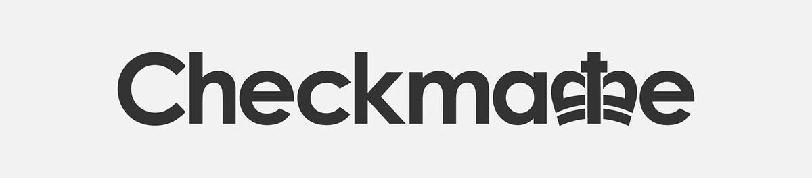

# Meeting Minutes

## 24/01/22 – First meeting (1 Hour 25 minutes)
The first meeting was an introductory session for the group. During the meeting we discussed various topics such as the name for the group and getting 
to know eachother.[@ZOulhadj](https://github.com/ZOulhadj) comes up with the name for the group. 
## 26/01/22 - Second meeting( 30 min)
During this meeting, we decided on the base principles of the Code of Conduct.[@archeris32](https://github.com/archeris32) agrees to draft the base of the 
Code of Conduct.Everyone else contribute with different ideas about what the Code of Conduct should have.[@KezzyRk](https://github.com/KezzyRk) shows us a 
basic logo idea .
## 31/01/22 – Initial project requirements (2 hours 4 minutes)
Our main priority for this meeting was to ensure we were all on the same page regarding who oversees what and how the team will work together.[@ZOulhadj] has 
some previous experience with GitHub, so during this meeting he shares some knowledge with us about how the project should be set-up.
We also decide on who's going to do what for this sprint:
[@ZOulhadj](https://github.com/ZOulhadj)- GitHub Set-Up
[@Nero-DevOps](https://github.com/Nero-DevOps)-Dockerfile Set-up
[@archeris32](https://github.com/archeris32)-Code of Conduct
[@KezzyRk](https://github.com/KezzyRk)- First release created

## 02/02/22 – Progress update (35 minutes)
The third meeting was quite a short one due to the extensive meeting that we had the previous week. Over the course of this meeting, we simply cross-checked 
with each other to ensure that we were on the right track. Furthermore, this gave us an opportunity to ask each other questions as well as to provide some help.
Final touch-ups before uploading Sprint 1.
We also decided that because all the requirements of Sprint 1 are done acording to the board, we can start Sprint 2.

## 07/02/22 – Progress update 2 (20 minutes)
We all agreed that this week we can slow down the work on this project as we had another important project to prepare for.
The base for the future project is released on GitHub thanks to  [@Nero-DevOps](https://github.com/Nero-DevOps) and [@ZOulhadj](https://github.com/ZOulhadj).
Everyone agrees to do some testing of the base and add up a few things/ideas
## 09/02/22 – Progress update (15 minutes)
We cross-checked with each other to ensure that we were on the right track. 
## 14/02/22 - Meeting canceled
Due to health issues and other we decided that this week will be no meeting. Everyone should continue to work on their current assignments
## 21/02/2022 -Checking eachothers work(45 minutes)
After 1 week of "holidays" , we came back to work.
During this meeting we assigned tasks to a few members of the group.
[@ZOulhadj](https://github.com/ZOulhadj) - Issue being used & Continue with the development & create Abous Us page and use of Personas
[@archeris32](https://github.com/archeris32)- Use case diagram & Continue with the development 
[@Nero-DevOps](https://github.com/Nero-DevOps)-Continue developing the base

## 23/02/2022 -Update meeting(20 minutes)
Due to the fact that some people weren't able to attend the class in person due to various conditions, we held a meeting to bring them up to date with all the requirements
and new information that we recevied during today's class.

## 28/02/2022 -Update meeting(50 minutes)
We have a video call on our Discord group. Everyone shares their ideas about how to improve the WebApp. 
[@ZOulhadj](https://github.com/ZOulhadj) tells us about [Bootstrap](https://getbootstrap.com/).We find it really helpful.

# Group Members
* [@ZOulhadj](https://github.com/ZOulhadj)
* [@Nero-DevOps](https://github.com/Nero-DevOps)
* [@archeris32](https://github.com/archeris32)
* [@KezzyRk](https://github.com/KezzyRk)

# Code of Conduct
The principles stated in our group's (*[Code of Coduct](coursework/CODE_OF_CONDUCT.md)*) were respected during this meetings.
